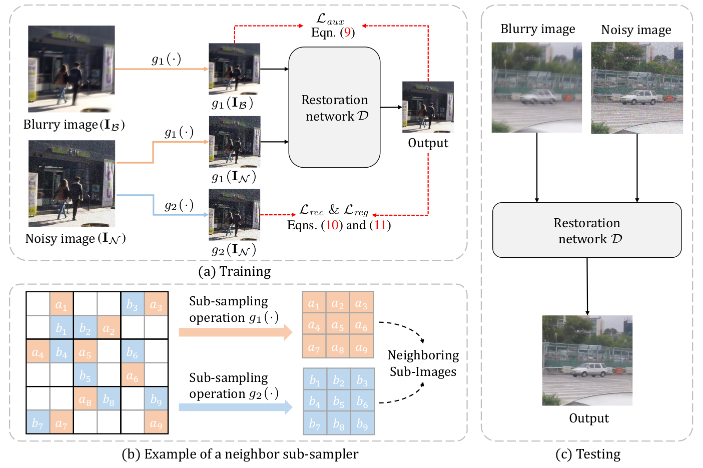

# SelfIR (NeurIPS 2022)

PyTorch implementation of [**Self-Supervised Image Restoration with Blurry and Noisy Pairs**](https://arxiv.org/abs/2211.07317) 

[**OpenReview**](https://openreview.net/forum?id=lkrnoLxX1Do) &nbsp; | &nbsp; 
[**arXiv**](https://arxiv.org/abs/2211.07317) &nbsp; | &nbsp; 
[**video**](https://www.bilibili.com/video/BV1v8411j7XZ/?spm_id_from=333.337.search-card.all.click)

## 1. Framework

<p align="center"></p>
<p align="center">Overview of our proposed SelfIR framework.</p>

- (a) Training phase of SelfIR. Sub-sampled blurry image $\mathit{g}_1(\mathbf{I}_\mathcal{B})$ and noisy image $\mathit{g}_1(\mathbf{I}_\mathcal{N})$ are taken as the inputs. $\mathit{g}_2(\mathbf{I}_\mathcal{N})$ is used for calculating the reconstruction loss $\mathcal{L}_\mathit{rec}$ and regularization loss $\mathcal{L}_\mathit{reg}$, while $\mathit{g}_1(\mathbf{I}_\mathcal{B})$ is taken for calculating auxiliary loss $\mathcal{L}_\mathit{aux}$.
- (b) Example of neighbor sub-sampler. In each $2\times2$ cell, two pixels are randomly selected for respectively composing the neighboring sub-images.
- (c) Testing phase of SelfIR. The blurry and noisy images can be directly taken for restoration.

## 2. Preparation and Datasets

- **Prerequisites**
    - Python 3.x and **PyTorch 1.6**.
    - OpenCV, NumPy, Pillow, tqdm, lpips, scikit-image and tensorboardX.

- **Dataset**
    - **GoPro dataset** can be downloaded from this [link](https://drive.google.com/file/d/1y4wvPdOG3mojpFCHTqLgriexhbjoWVkK/view).
    - **Synthetic noisy images with Gaussian noise for testing** can be downloaded from this [link](https://pan.baidu.com/s/1eA8r5QoX0cLXSfikk6XlQw?pwd=vagc). Please decompress the files according to the commands provided in its `readme.txt`.
    - **Synthetic noisy images with Poisson noise for testing** can be downloaded from this [link](https://pan.baidu.com/s/1tCCMxk7mlIk-27RD2_8GaA?pwd=fdw6). Please decompress the files according to the commands provided in its `readme.txt`.
    - The directory structure of the dataset:

        ```
        GOPRO_Large 
        │
        └───train
        │        GOPR0372_07_00
        │        GOPR0372_07_01
        |        ...  
        │   
        └───test
        │        GOPR0372_07_00
        │        GOPR0372_07_01
        |        ... 
        │   
        └───test_noise_gauss5_50
        │        GOPR0372_07_00
        │        GOPR0372_07_01
        |        ... 
        │   
        └───test_noise_poisson5_50
                 GOPR0372_07_00
                 GOPR0372_07_01
                 ... 
        ```
   

    

## 3. Quick Start

### 3.1 Pre-trained models

- For Gaussian noise, we provide the pre-trained models in the `./ckpt/selfir_gauss_noise/` folder.

- For Poisson noise, we provide the pre-trained models in the `./ckpt/selfir_poisson_noise/` folder.


### 3.2 Training

- Modify `dataroot`, `type` and `name` in `train.sh` and then run:

    [`sh train.sh`](train.sh)

### 3.3 Testing

- Modify `dataroot`, `type`, `name` and `iter` in `test.sh` and then run:

    [`sh test.sh`](test.sh)

### 3.4 Note

- You can specify which GPU to use by `--gpu_ids`, e.g., `--gpu_ids 0,1`, `--gpu_ids 3`, `--gpu_ids -1` (for CPU mode). In the default setting, all GPUs are used.
- You can refer to [options](./options/base_options.py) for more arguments.


## 4. Citation
If you find it useful in your research, please consider citing:

    @inproceedings{SelfIR,
        title={Self-Supervised Image Restoration with Blurry and Noisy Pairs},
        author={Zhang, Zhilu and Xu, Rongjian and Liu, Ming and Yan, Zifei and Zuo, Wangmeng},
        booktitle={NeurIPS},
        year={2022}
    }

## 5. Acknowledgement

This repo is built upon the framework of [CycleGAN](https://github.com/junyanz/pytorch-CycleGAN-and-pix2pix), and we borrow some code from [Neighbor2Neighbor](https://github.com/TaoHuang2018/Neighbor2Neighbor), thanks for their excellent work!